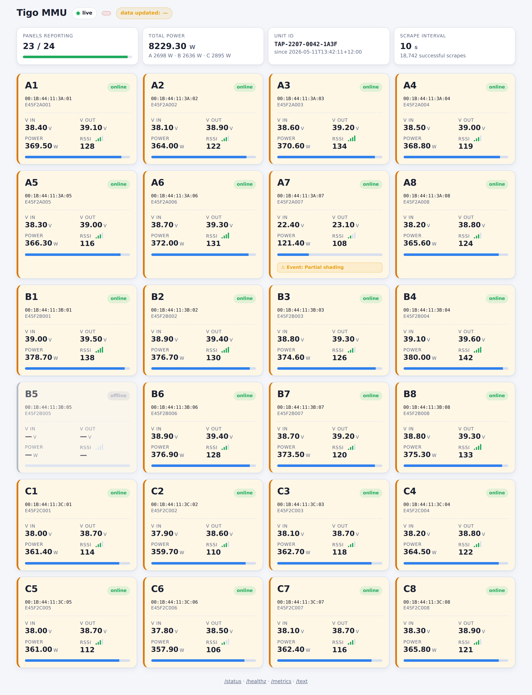
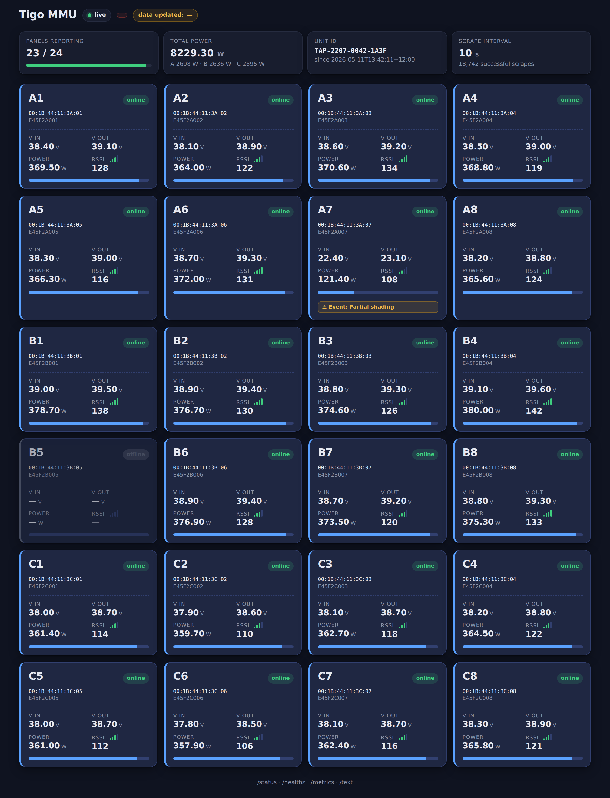
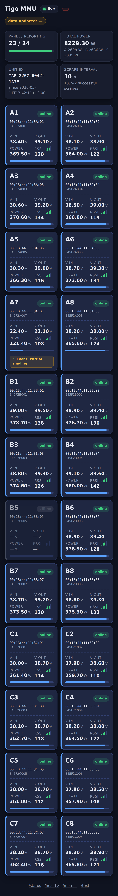

# tigo-mmu-influx

Scrape panel-level data from a [Tigo](https://www.tigoenergy.com/) MMU (Module
Maintenance Unit) status page and write it to **InfluxDB 2.x**, with
a small Flask dashboard on top.



<details>
<summary>More screenshots</summary>

| Dark | Mobile |
| --- | --- |
|  |  |

</details>

The MMU exposes an HTML status page on the local network (typically at
`http://192.168.1.1/cgi-bin/mmdstatus`). This app polls that page on a
schedule, parses the per-panel readings, writes them to InfluxDB as line
protocol, and serves:

| Endpoint      | Purpose                                              |
| ------------- | ---------------------------------------------------- |
| `/`           | Responsive HTML dashboard                            |
| `/text`       | Plain-text status summary                            |
| `/status`     | JSON with scheduler + last-scrape state              |
| `/api/panels` | JSON with the latest panel readings (used by `/`)    |
| `/healthz`    | `200` if last scrape succeeded recently, else `503`  |
| `/metrics`    | Prometheus-style counters                            |

The scraper auto-backs-off on consecutive failures and persists its state
between restarts.

---

## Requirements

- A Tigo CCA
- An InfluxDB 2.x instance reachable from this app.
- One of:
    - **Docker** + Docker Compose (easiest), or
    - **Python 3.11+** if you prefer to run it directly.

---

## Quick start (Docker Compose)

1. Clone the repo and enter it:

    ```bash
    git clone https://github.com/<you>/tigo-mmu-influx.git
    cd tigo-mmu-influx
    ```

2. Copy the example env file and edit it with your MMU + InfluxDB details:

    ```bash
    cp tigo_env.example tigo.env
    $EDITOR tigo.env
    ```

    At minimum set:

    - `MMU_URL`, `MMU_USER`, `MMU_PASS`
    - `INFLUX_URL`, `INFLUX_TOKEN`, `INFLUX_ORG`, `INFLUX_BUCKET`

3. Build and start:

    ```bash
    docker compose up -d --build
    ```

4. Open the dashboard:

    ```
    http://<docker-host>:8088/
    ```

Logs:

```bash
docker compose logs -f tigo
```

Stop / update:

```bash
docker compose down
docker compose pull && docker compose up -d --build
```

State (success/failure counters, last panel snapshot) is persisted in the
`tigo_state` named volume mounted at `/opt/tigo`.

---

## Quick start (plain Python)

```bash
python3 -m venv .venv
source .venv/bin/activate
pip install -r requirements.txt

cp tigo_env.example tigo.env
$EDITOR tigo.env

# Load env vars and run
set -a; source ./tigo.env; set +a
python tigo_app.py
```

The app listens on `http://0.0.0.0:8088` by default.

---

## Running as a systemd service

A unit file is provided in [tigo.service](tigo.service). The expected layout is:

```
/opt/tigo/                 # repo checkout (also holds state.json)
/opt/tigo/venv/            # virtualenv with requirements.txt installed
/etc/tigo.env              # your env file (chmod 600, owner tigo:tigo)
```

Setup:

```bash
sudo useradd --system --home /opt/tigo --shell /usr/sbin/nologin tigo
sudo mkdir -p /opt/tigo
sudo chown -R tigo:tigo /opt/tigo
sudo -u tigo git clone https://github.com/<you>/tigo-mmu-influx.git /opt/tigo
sudo -u tigo python3 -m venv /opt/tigo/venv
sudo -u tigo /opt/tigo/venv/bin/pip install -r /opt/tigo/requirements.txt

sudo cp tigo_env.example /etc/tigo.env
sudo chown tigo:tigo /etc/tigo.env
sudo chmod 600 /etc/tigo.env
sudo $EDITOR /etc/tigo.env

sudo cp tigo.service /etc/systemd/system/tigo.service
sudo systemctl daemon-reload
sudo systemctl enable --now tigo.service
sudo systemctl status tigo.service
```

---

## Configuration reference

All configuration is via environment variables. See
[tigo_env.example](tigo_env.example) for the full list with defaults.

Most useful knobs:

| Variable                 | Default                                 | Purpose                                              |
| ------------------------ | --------------------------------------- | ---------------------------------------------------- |
| `MMU_URL`                | `http://192.168.1.1/cgi-bin/mmdstatus`  | Tigo MMU status page                                 |
| `MMU_USER` / `MMU_PASS`  | `user` / `tigo1`                        | MMU credentials (basic or digest auth, auto-tried)   |
| `INFLUX_URL`             | `http://localhost:8086`                 | InfluxDB v2 base URL                                 |
| `INFLUX_TOKEN`           | —                                       | InfluxDB v2 API token                                |
| `INFLUX_ORG`             | `my-org`                                | InfluxDB v2 organisation                             |
| `INFLUX_BUCKET`          | `tigo`                                  | Destination bucket                                   |
| `SCRAPE_INTERVAL_SEC`    | `10`                                    | Base scrape interval                                 |
| `MAX_INTERVAL_SEC`       | `300`                                   | Cap when backing off after failures                  |
| `BACKOFF_AFTER_FAILURES` | `3`                                     | Start exponential backoff after this many failures   |
| `LISTEN_HOST`            | `0.0.0.0`                               | Web server bind address                              |
| `LISTEN_PORT`            | `8088`                                  | Web server port                                      |
| `STATE_FILE`             | `/opt/tigo/state.json`                  | Where to persist counters / last snapshot            |
| `PAGE_TZ`                | `Pacific/Auckland`                      | Timezone of the timestamp printed on the MMU page    |
| `LOG_LEVEL`              | `INFO`                                  | Standard Python logging level                        |

---

## What gets written to InfluxDB

Two measurements are written each cycle:

- `tigo_system` — tagged by `unit_id`; fields: `lmus_reporting`,
  `lmus_total`, `status_message`.
- `tigo_panel` — tagged by `unit_id`, `label`, `barcode`, `mac`, `slot`;
  fields include `vin`, `vout`, `current_a`, `power_w`, `power_pct`,
  `temp_c`, `rssi`, `brssi`, `vmpe`, `mode`, `bypass`, `event`,
  `status_raw`, `extra_raw`, `details_raw`, and a boolean `reporting`.

Measurement names can be overridden with `PANEL_MEASUREMENT` and
`SYSTEM_MEASUREMENT`.

---

## License

[MIT](LICENSE)
